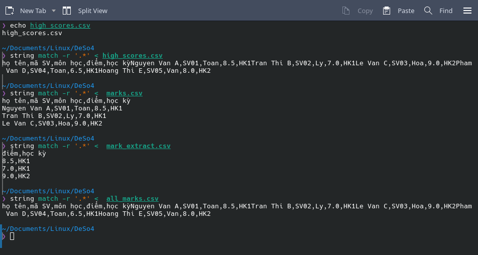
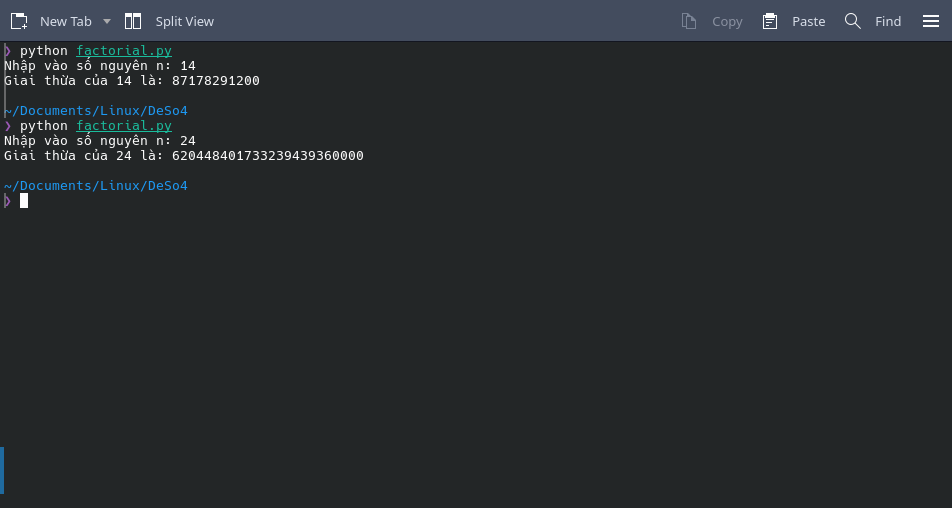
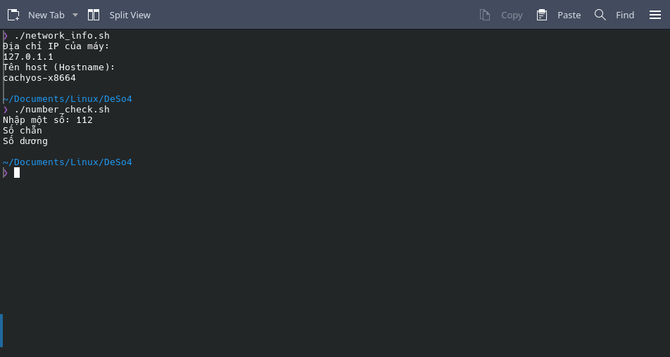

# Bài Tập Thực Hành Linux - Đề 4 & Đề 5

Repository này lưu trữ lời giải chi tiết và kết quả thực hiện các bài tập thực hành Hệ điều hành mã nguồn mở (Linux Shell & Python).

* **Môi trường thử nghiệm:** CachyOS (Arch Linux)

---

## 📸 Minh Họa Kết Quả Thực Hiện

Tất cả ảnh chụp màn hình quá trình chạy và kiểm tra kết quả được lưu trữ trong thư mục `picture/`.

### 1. Đề số 4 - Câu 1 & Câu 2 (Thao tác File CSV)
Quá trình tạo file, trích xuất dữ liệu điểm số, nối file và lọc các sinh viên có điểm số $\ge 8$ bằng Fish Shell:

### 2. Đề số 5 - Câu 1 & Câu 2 (Quản lý Thư viện)
Kết quả trích xuất dữ liệu sách và thực hiện sắp xếp danh sách tổng hợp `library.csv` theo năm xuất bản (Cột 3) tăng dần:
.png)

### 3. Tính toán với Python (Câu 3)
* **Đề 4:** Script `factorial.py` tính giai thừa với các giá trị số nguyên lớn:
  

* **Đề 5:** Script `sum_digits.py` xử lý tách chuỗi và tính tổng các chữ số của một số nguyên dương:
  .png)

### 4. Kiểm tra hệ thống bằng Script Bash (Câu 4 & Câu 5)
* **Đề 4:** Thực thi `network_info.sh` lấy IP/Hostname và `number_check.sh` kiểm tra tính chất số:
  

* **Đề 5:** Thực thi `user_check.sh` kiểm tra tài khoản hệ thống và `for_loop_example.sh` in bảng lũy thừa của 2:
  .png)
